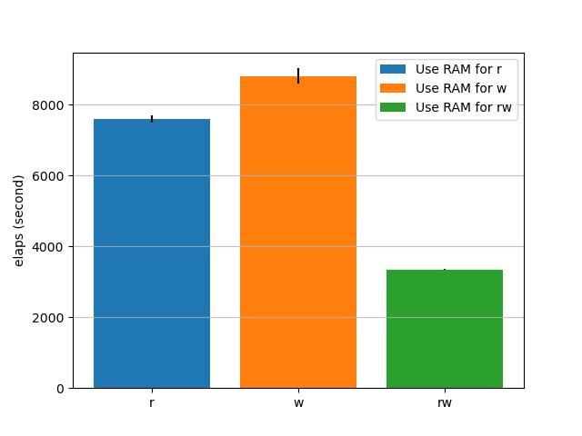

# Test calculations of CURP

## Problem of MPI

I found how to avoid the problems. Use `util/load_curp_ims`.

## Disk access speed.

Which is the bottle neck ?

- Read time
- Write time
- Both of them

We already know that it is not matter at FLOW. This is unique problem at IMS because the disk access speed is too low.

### Methods and Materials

- Read/Write on RAM
  - `t_rw_RAM`
  - 9440183 to 9440187. 5 jobs.
- Read on RAM
  - `t_r_RAM`
  - 9440199 to 9440203. 5 jobs.
- Write on RAM
  - `t_w_RAM`
  - 9440218 to 9440221. 4 jobs + 9440258. Totally 5 jobs were submitted.

Disks are User directory instead of `/work` directory. See below table of data size

|data type  |size   |
|-----------|-------|
|coordinates| 6.8 GB|
|velocities | 6.8 GB|
|flux(output)|840 MB|

All test was performed at ccnn node. Each job use only one node. See below about the machine spec

- Xeon Gold 6148
  - 40 core/node
- 192GiB/node

Run 40 parallel processes using MPI(`intel_parallelstudio/2018update2`), then each process run on single core.

### Results

"r" mean "Read", "w" mean "Write", and "rw" mean "Read and Write.

The most effective dominant IO is reading trajectory. Interestingly, although file size is significantly different between trajectory and flux data(~ x8), the difference of them on results is small.

### Discussion

- Let's test other super computers.
- Use RAM disk on IMS !
